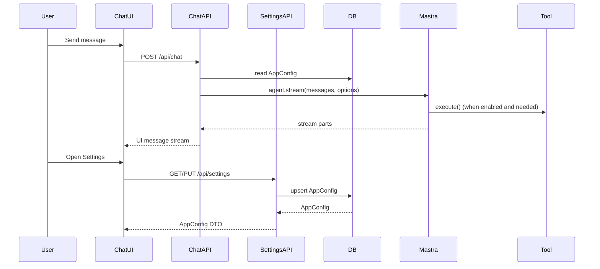

# アーキテクチャ概要

## 目的

- **初見で迷わない**: 主要コンポーネントとデータフローを 1 枚で理解できる状態にする
- **拡張しやすい**: Agent/Tool/Settings の追加ポイントがどこか分かる状態にする

## 全体像

このアプリは「チャットUI」→「Next.js API」→「Mastra Agent」→（必要なら）「Tool実行」をストリーミングでつなぎます。設定（system prompt / model / enabled tools / voice settings）は SQLite（Prisma）に保存し、UIから変更できます。

## 重要な設計方針

### 設定の優先順位

1. **DB**（Settings画面で保存した値）
2. **環境変数**（例: `MODEL_ID`）
3. **コード内のデフォルト**（フォールバック）

### Toolの扱い（UX事故防止）

Toolは「内部実装」です。ユーザー向けのテキストに、tool呼び出しログや tool結果をそのまま出さない設計にします。

- **許可制御**: ユーザーの意図が tool を必要としない場合は、tool を無効化して実行します
- **最終防衛**: もし model が toolログ風の文字列を生成しても UI に流さない（サニタイズ）

## 拡張ポイント

### Toolを追加する

- 追加: `mastra/tools/*.ts`
- 登録: `mastra/tools/registry.ts`
- UI反映: Settings → Tools タブ（`/settings/tools`）

詳細: [`docs/extension-tools.md`](extension-tools.md)

### Agentを追加する

- 追加: `mastra/agents/*.ts`
- 登録: `mastra/index.ts`（将来的には `mastra/agents/registry.ts` に集約）

詳細: [`docs/extension-agents.md`](extension-agents.md)

### Settings項目を追加する

詳細: [`docs/extension-settings.md`](extension-settings.md)

