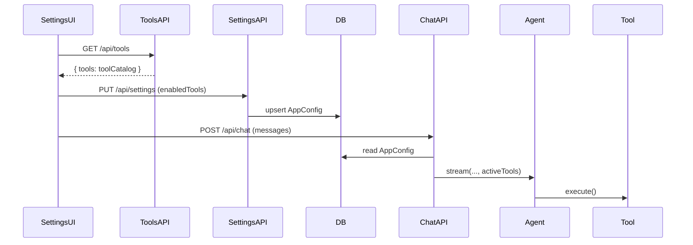

## ツール追加（開発者向け拡張ポイント）

### 目的

- **初見で迷わない**: ツール追加の手順を一本道にする
- **差分が局所化される**: 触るファイルは基本2箇所だけにする

### 追加手順（最短）

1) `mastra/tools/` にツールを追加

- 例: `mastra/tools/my-tool.ts`
- `createTool({ id, description, inputSchema, outputSchema, execute })` を実装

2) `mastra/tools/registry.ts` に登録

- `tools` オブジェクトにキーを追加します
- **このキー**が Settings 画面での識別子になり、`enabledTools` に保存されます

3) 画面で有効化する

- Settings 画面でチェックを入れて保存
- 次回 `/api/chat` 実行時に `activeTools` として Mastra Agent に渡されます

### データフロー（理解用）

